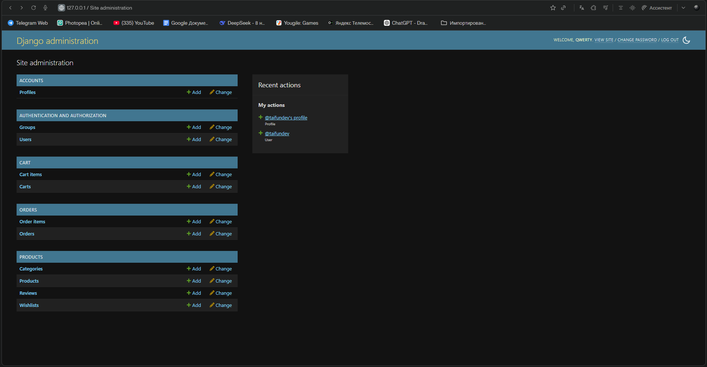
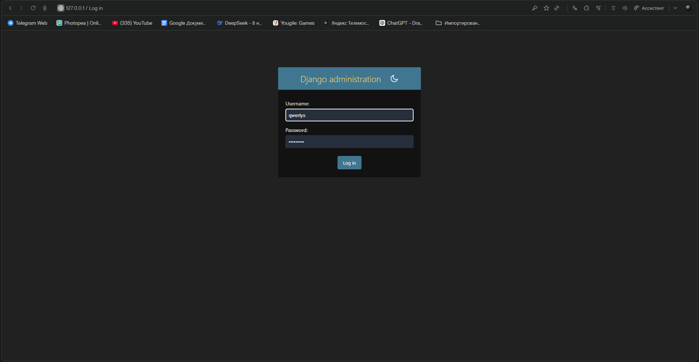
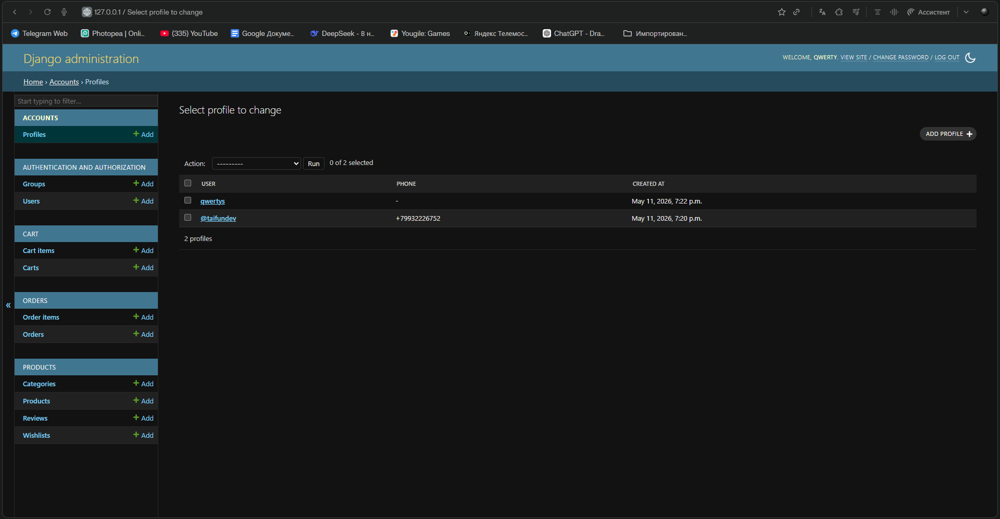
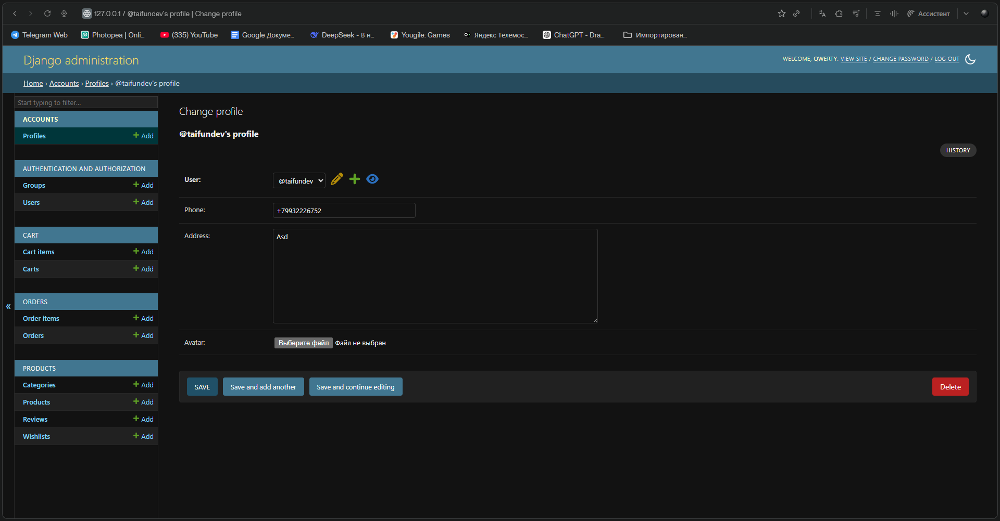

# 🛒 Store API - Django REST Framework

<div align="center">


**Complete e-commerce REST API with authentication, products, cart, and orders**

</div>

---

## 📖 About

A production-ready REST API for an online store built with Django REST Framework.

---

## ✨ Features

| Feature | Description |
|---------|-------------|
| 🔐 JWT Auth | Register, login, token refresh |
| 👤 Profile | User profile management |
| 📦 Products | List, search, filter, categories |
| ⭐ Reviews | Rate and review products |
| 💾 Wishlist | Save favorite products |
| 🛒 Cart | Add/remove items, update quantities |
| 📝 Orders | Create orders, view history |

---

## 🛠️ Tech Stack

- Python 3.10+
- Django 5.x
- Django REST Framework
- Simple JWT
- SQLite / PostgreSQL

---

## 🚀 Quick Start

### Installation

```bash
# Clone and setup
mkdir store-api && cd store-api
python -m venv venv
venv\Scripts\activate  # Windows
# source venv/bin/activate  # Mac/Linux

# Install dependencies
pip install django djangorestframework djangorestframework-simplejwt django-filter pillow django-cors-headers

# Create project
django-admin startproject storeproject .
python manage.py startapp accounts
python manage.py startapp products
python manage.py startapp cart
python manage.py startapp orders
```

### Migrate & Run

```bash
python manage.py makemigrations
python manage.py migrate
python manage.py createsuperuser
python manage.py runserver
```

---

## 📡 API Endpoints

### Authentication

| Method | URL                  | Description   |
|--------|----------------------|---------------|
| POST   | `/api/token/`        | Login         |
| POST   | `/api/token/refresh/`| Refresh token |

### Accounts

| Method | URL                           | Description        |
|--------|-------------------------------|--------------------|
| POST   | `/api/accounts/register/`     | Register           |
| GET/PUT| `/api/accounts/profile/`      | Profile            |
| POST   | `/api/accounts/change-password/` | Change password |

### Products

| Method | URL                           | Description         |
|--------|-------------------------------|---------------------|
| GET    | `/api/products/`              | List products       |
| GET    | `/api/products/categories/`   | List categories     |
| GET    | `/api/products/<slug>/`       | Product details     |
| POST   | `/api/products/<slug>/reviews/` | Add review       |
| GET/POST | `/api/products/wishlist/`   | Wishlist            |

### Cart

| Method | URL                       | Description         |
|--------|---------------------------|---------------------|
| GET    | `/api/cart/`              | Get cart            |
| POST   | `/api/cart/add/`          | Add to cart         |
| PUT    | `/api/cart/update/<id>/`  | Update quantity     |
| DELETE | `/api/cart/remove/<id>/`  | Remove item         |

### Orders

| Method | URL                     | Description         |
|--------|-------------------------|---------------------|
| GET    | `/api/orders/`          | List orders         |
| POST   | `/api/orders/create/`   | Create order        |
| GET    | `/api/orders/<id>/`     | Order details       |
| POST   | `/api/orders/<id>/cancel/` | Cancel order     |

---

## 📸 Screenshots

<div align="center">
  
  
  
  
</div>

---

## 🔧 Filtering & Search

```text
# Filter by category
GET /api/products/?category=electronics

# Search by name
GET /api/products/?search=laptop

# Sort by price
GET /api/products/?ordering=price
GET /api/products/?ordering=-price
```

---

## 🗃️ Admin Panel

```text
http://127.0.0.1:8000/admin/
```

---

## 🐛 Troubleshooting

| Problem          | Solution                              |
|------------------|---------------------------------------|
| 404 at `/`       | Use `/api/products/` or `/admin/`     |
| Token invalid    | Check JWT_SECRET in settings          |
| CORS error       | Set `CORS_ALLOW_ALL_ORIGINS = True`   |
